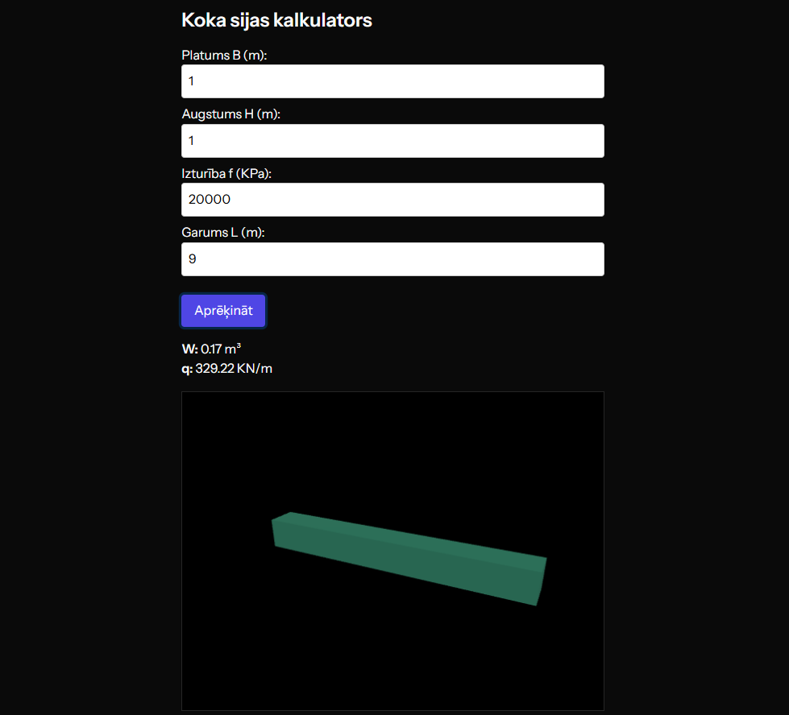

# Wood-Pressure

## How to run?
1. composer install
2. php artisan migrate
3. npm install three
4. npm install --save-dev electron
5. npm run build
6. npm run electron
7. php artisan serve

'(you need to open xampp and create db there too, remember about .env)'